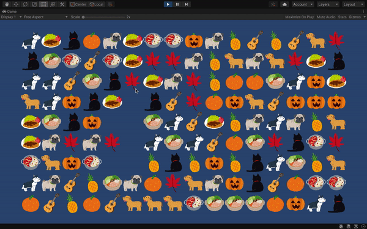

# Mahjong Solitaire (a.k.a 连连看)

Arthor: Qinye Li (qinyeli@umich.edu)  
Last updated: Oct, 2020

## About

We were all slacking off in the living room the other night when my landlord started playing [连连看 on 4399.com](http://www.4399.com/flash/17801_4.htm). It soon turned into a heated competition between Ms.Landlord vs. tenants team, but she was so good at 连连看 that none of use could beat her.

And then I thought, hey this game shouldn't be that hard to write, and it'd be really fun if we could customize the game with pictures that are more relatable.

## Gameplay

## Resources

[1] The pictures used in the game are from [いらすとや](https://www.irasutoya.com/). It's a really cool ryalty-free illustrations website from Japan. I sometimes spend my time browsing through the website just for fun. Check it out!
